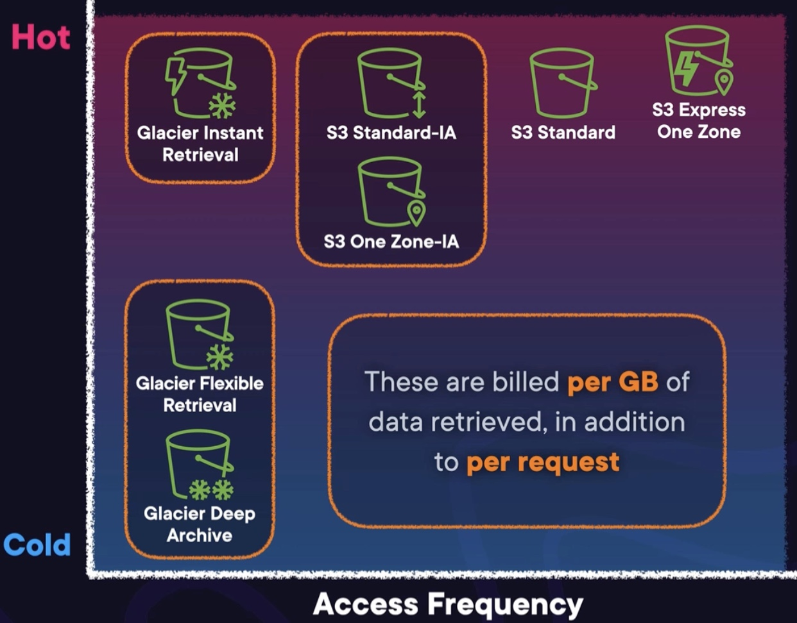

# Total Cost of Ownership

The principal of counting all underlying costs on premise as:

- developers and architecture
- maintainers of the systems
- cost of disaster
- cost of expense
- electricity, cooling, ...

> Advantage of Could Computing
>
> - trade Fixed expense to Variable expense
> - beneficent of massive economies of scale
> - stop guessing capacity
> - increase speed and agility
> - stop maintaining data centers
> - go global in minutes

## The Fixed vs Variable expense

Adopting fixed expense, you need to provision enough capacity to meet the pick demand.
You will be paying all the resources even when the demand is low.

## Stop guessing Capacity

On premise, being faced to variable workload force you to set a capacity:

- the business would be losing money whenever the workflow exceeds this capacity.
- the business would experience money waste whenever the workload is less that the capacity.

## Economies of Scale

AWS aggregates the use of resources between hundreds of thousands of users. That how AWS can offer low pay as-you-go
prices.

## Cost of extension

Being of premise makes extension time-consuming and expensive. On AWS it's instantly.

# Optimizing the cost of compute

Lift and shift (as is) migrating to the cloud is never optimal in terms of cost.
The architecture should be reconsidered.

## Auto-scaling

Allows to put EC2 instances in auto-scaling groups, and will <u>stop and start</u> only when needed.
It reduces wasting computing capacities

## Right-Sizing instances

Avoiding over provisioning EC2 instances helps meet the usage curve.

## Reserved Instances

It's ideal when knowing the workload in advance.
> - reserving instances can reduces cost to 72% based on 1 to 3 year contracts.
>
> - paying upfront gives extra discount.

### Standard Reserve instance

Reserve a particular instance type

> Give access to significantly discounted hourly rate

### Convertible reserve capacity

To be used when not sure of the type of the capacity needed in the future.
> The discount is smaller but keeps flexibility

### Scheduled reserved instance

Reserve a particular instance type for a defined time window

> Ideal for scheduled batches

### Spot Instances

Are like discounted instances available when AWS have huge surplus on available compute power

> Ideal for workload with flexibility on the execution time

## Compute Optimizer

Analyze CouldWatch and with ML provides right-sizing recommendations for EC2.

## AWS Lambda

Lambda has no cost and is great for event-driven workloads.

## AWS Fargate

Is similar to Lambdas but specific to containerized workloads. (Kubernetes & ECS)

# Understanding Data Storage Cost

## S3 Lifecycle Configuration

S3 Storage classes are mode of pricing for S3 buckets

### S3 Standard

For maximum durability and quick retrieval

### S3 Standard - IA

For maximum durability and quick retrieval, but less frequently retrieved

### S3 One Zone - IA

Less durable with a discount

### S3 Express One Zone

Single AZ with 1 millisecond latency

### Glacier Flexible Retrieval

### Glacier Flexible Archive

### Glacier Instant Retrieval

## S3 Lifecycle Configuration

Create per-object policies that define transaction actions and expiration actions.

## S3 Intelligent Tiering

Constantly analyzes the access to S3 Bucket and automatically changes storage classes.

## S3 Storage Lens

Tool to analyze S3 Buckets throughout organization and give recommendations about storage classes.

# Data Transfer Cost

> The further data has to physically travel, the more expensive the transfer is.

## Internet <> AWS

### Inbound

Always

### Outbound

Most expensive transfer cost
> 10 cents/GB and tends to less with depending on the transferred volumes

## With-in AWS

### same region

Tend to be very cheap and sometimes free

- with-in AZ is free
- between AZ: can be expensive: need to check if the best way to communicate with a specific resource

### different region

Second most expensive transfer
> Billed by GB

# Monitoring and Predicting costs on AWS

## Pricing Calculator

Access potential cloud costs

- you provide services and configurations
- an estimation is provided

## AWS Budgets

Customize budgets

- receive an alert when exceeding threshold.
- create reports

## Cost Explorer

Dynamic dashboard to Project and Monitor could cost

- can create custom dashboards

## Cost and Usage report

Provides and analyzes historical cost data

## Multi-account Environment

- provides consolidated billing
- monitor cost at account or organization level

## Billing Conductor

Used to group billing part of multiple accounts on an organization.

- tags can also be used to group

# AWS Support

- open ticket and receive advice from AWS Experts

Multiple support plan are available:

## Basic plan

- 0$ / month
- AWS Health dashboard
- Trusted Advisor FREE checks
- access to customer service and documentation

## Developer plan

- 29$ / month
+ receive GENERAL guidance with 12-24h depending on the severity

## Business plan

- 100$ / month
+ Trusted Advisor FULLSET checks
+ receive CONTEXTUAL guidance with 1-24h depending on the severity
+ 24/7 access to phone, web or chat support team 

## Enterprise On-Ramp plan

- 5500$ / month
+ receive CONTEXTUAL guidance with 30 minutes depending on the severity
+ Limited consultative review and guidance
+ Proactive guidance from a pool of Technical Account Managers
+ Concierge for billing issues

## Enterprise plan

- 15000$ / month
+ Unlimited consultative review and guidance
+ Proactive guidance from a Designated Technical Account Manager
+ Proactive billing support

# Other ways to get support

## AWS IQ

certified freelancers ready to help

## AWS Managed services

a catalog of managed services

## AWS Professional Services

Consultants working for AWS

## AWS Activate

for Startups